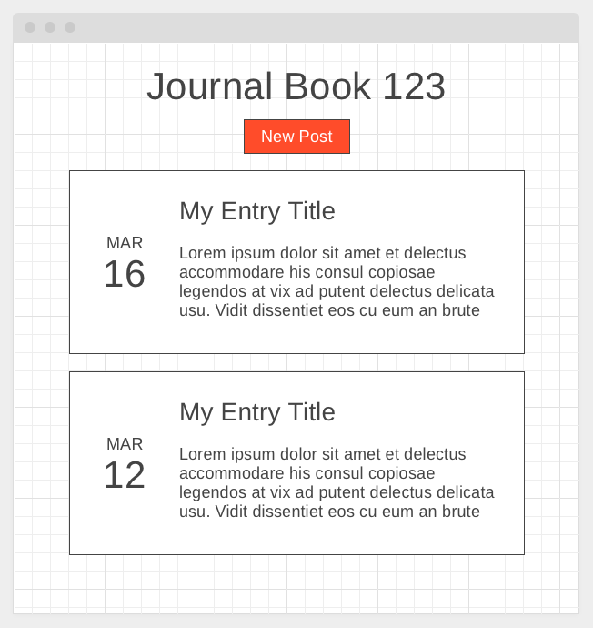
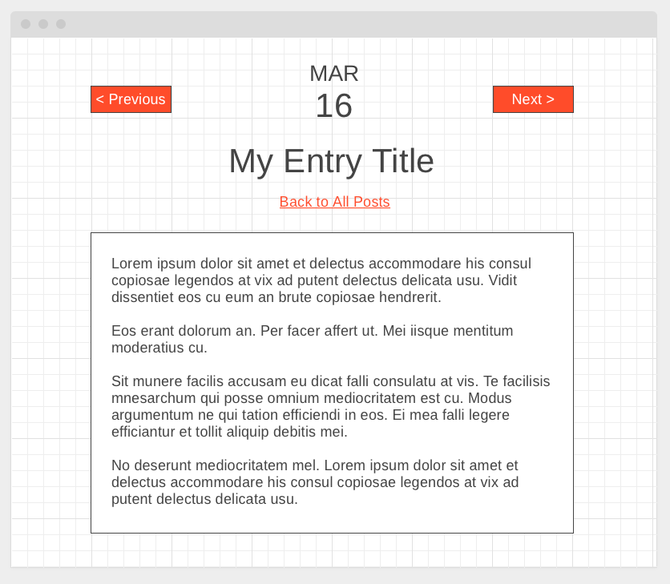
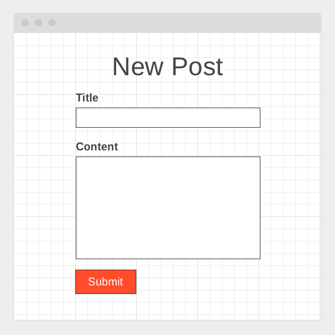

## Frontend React Take-home Project

Welcome! This is a project to assess your technical skills using React.js. In short, this assessment will cover:

- React components (both functional and class style)
- API integration (HTTP requests for both reading data and posting data from user input)
- Client-side routing (Single-Page Application navigation with working links)
- CSS layout & styling
- Integration with third party libraries

You will need node 8.10.0+ installed to complete this project.

## Prompt

Your task is to create a simplified journaling app. Your app will be able to:

1. Load a list of existing journal entries
2. Create a new journal entry

You must:

- Use a client-side routing library (anything that uses & updates the browser url or hash)

See below for detailed requirements on each feature.

When you're done, zip up your solution and email it to <a href="email:takehomes@cspa.io">takehomes@cspa.io</a>.

### 1. Index Page

Create a `/journals/:id` route where a user can view a list of all journal entries sorted in descending order.

**For the purpose of the assessment** this should include writing and using a stateless functional component named `ListEntry`.

Using `GET https://assessments.api.cspa.io/journals/:id`, fetch the current journal (in your case, id = `999`) and display the journal title on the page.

Using `GET https://assessments.api.cspa.io/journals/:id/entries`, fetch the entries for the current journal and render them to the page as as a list. Each list item should display:

- The entry title
- The entry date
- The entry summary

The title should be a link that takes the user to its respective entry page (see section 2).

Also include a `New Post` button to take the user to the New Entry page (see section 3).

The page layout should look roughly like the following:



### 2. Entry Page

Create a `/journals/:journalId/entries/:id` route where a user can view a single, full journal entry.

Using `GET https://assessments.api.cspa.io/journals/:journalId/entries/:id`, fetch an individual entry for journal id `999` and display it on the page. It should display:

- The entry title
- The entry date
- The entry body
- A `Next` link if there is a newer entry than this one
- A `Previous` link if there is an older entry than this one
- A `Back to All Posts` link that takes the user back to the Index page

The page layout should look roughly like the following:



### 3. New Entry Page

Create a `/journals/:id/new` route where a user can create a new journal entry. This should be a form with fields for:

- The entry title
- The entry body

**For the purpose of the assessment** this should be a class component with state.

Use a request like the following to create a new entry:

```
POST https://assessments.api.cspa.io/journals/123/entries
Content-Type: application/json

{"title":"My Post Title","body":"My body"}
```

After creating, redirect the user to the new entry's page.

If the server returns an error, display it to the user. No need to be fancy here, just show the raw server response in a red box somewhere visible on the page.

The page layout should look roughly like the following:



### 4. Miscellaneous

- When someone visits the root path, redirect to the page for journal id = `999`
- Ensure your app has no React development warnings

## Rubric

| Requirement                                | Scoring |
| ---                                        | ---     |
| Routes are named correctly                 | PPF     |
| [List Page] Correct data shown             | PPF     |
| [List Page] Correct layout                 | PPF     |
| [List Page] Title links                    | PPF     |
| [List Page] Correct order                  | PPF     |
| [List Page] Functional component usage     | PF      |
| [List Page] Code Quality                   | PD      |
| [Entry Page] Correct data shown            | PPF     |
| [Entry Page] Correct layout                | PPF     |
| [Entry Page] Working Next & Previous links | PPF     |
| [Entry Page] Code Quality                  | PD      |
| [New Entry Page] Class component usage     | PF      |
| [New Entry Page] Error display             | PPF     |
| [New Entry Page] Successful submission     | PPF     |
| [New Entry Page] Redirect                  | PPF     |
| [New Entry Page] User Interaction          | PD      |
| [New Entry Page] Code Quality              | PD      |
| Project structure                          | PD      |

`PF` stands for `Pass Fail`.

`PPF` stands for `Pass Partial Fail`, where Pass is 100% correct, Fail is nearly 0% correct, and Partial is in between.

`PD` stands for `Partial Deduction`. A major deduction is minus 2, whereas a partial deduction is minus 1. Multiple deductions are possible.

`Code Quality` means absense of issues, including bugs, poor programming practices (e.g. excessive use of global scope), coding formatting issues, and so on.

`User Interaction` means standard input elements work without issues.

`Project structure` means sensible directory layout, file naming, and so on.

## Available Scripts

The starter code in this project was generated by [Create React App](https://github.com/facebook/create-react-app).

In the project directory, you can run:

### `npm start`

Runs the app in the development mode.<br>
Open [http://localhost:3000](http://localhost:3000) to view it in the browser.

The page will reload if you make edits.<br>
You will also see any lint errors in the console.

### `npm test`

Launches the test runner in the interactive watch mode.<br>
See the section about [running tests](https://facebook.github.io/create-react-app/docs/running-tests) for more information.

## Learn More

You can learn more in the [Create React App documentation](https://facebook.github.io/create-react-app/docs/getting-started).

To learn React, check out the [React documentation](https://reactjs.org/).
